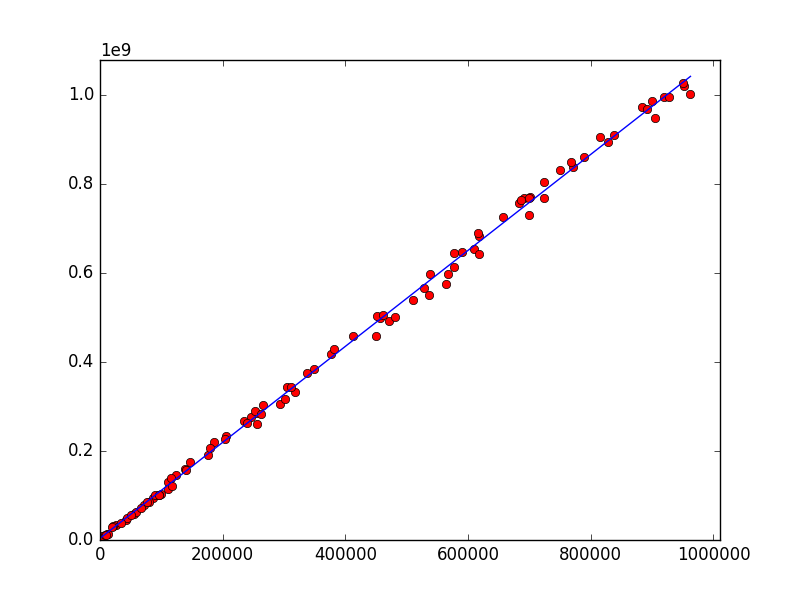

# Análise e Síntese de Algoritmos
## 1º Projeto - Grupo 109

### Introdução
Com este projeto pretendemos expor um algoritmo em tempo linear para o problema proposto, explicar a sua implementação e fazer uma análise teórica e experimental da complexidade temporal e espacial deste.

### Descrição do problema
O problema descrito pedia que, dentro de uma rede social onde a informação pode ser partilhada entre todas as pessoas da rede, encontrar pessoas que são fundamentais para a transmissão de informação. Isto é, pessoas que ao fossem removidas da rede social tornam impossível a transmissão de informação entre todos os membros da rede.

Ora este problema pode ser descrito como um problema num grafo não direcionado, em que:
 + cada pessoa é um vértice da rede;
 + uma ligação entre pessoas corresponde a uma aresta;
 + o grafo é um grafo conexo. ("existe sempre uma
forma de partilha de informação entre qualquer par de pessoas")

Assim, o problema descrito é equivalente ao de encontrar num grafo conexo G(V,E), com N = #V e L = #E, vértices que se forem removidos tornam o grafo desconexo, ou seja, de encontrar vértices de corte (articulation points).

### Algoritmo utilizado
Sendo o problema um cuja solução foi estudada nas aulas, utilizámos o algoritmo dado nas aulas - o algoritmo de Tarjan para encontrar vértices de corte - descrito como _biconnected components algorithm_ em [1]. A descrição do algoritmo será baseada na noção de tempo de descoberta que foi dada nas aulas, e não nas stack utilizadas em [1] (são equivalentes as implementações, já que as chamadas recursivas não são nada mais que utilizações da stack).

### Estruturas utilizadas:
+ G\[i]\[j] - O grafo G foi representado como uma lista de adjacências (foi utilizado um std::vector em vez de std::list, pelo facto de a implementação do std::vector ser bastante mais eficiente que a de std::list).
+ disco\[i] - tempo de descoberta do vértice i
+ low\[i] - tempo do mínimo valor de descoberta alcançável sem viajar pelo pai da àrvore DFS a partir do vértice i
+ parent\[i] - vértice pai do vértice i na àrvore DFS
+ AP[i] - o vértice i é Articulation Point?

### Explicação do algoritmo
 Para o caso de um grafo conexo não-direcionado com pelo menos 2 vértices, é executada uma pesquisa em profundidade ao longo dos vértices, a partir do vértice 1. Para cada vertice visitado na DFS é guardada informação relativa ao tempo de descoberta (vetor disco) e ao valor do tempo de descoberte do nó com menor tempo de descoberta acessível a partir do nó atual utilizando apenas arestas ainda não visitadas (vetor low). Se após uma chamada recursiva retornar, o valor de low do filho visitado for superior ao do pai então o pai é um vértice de corte.
Após todas as chamadas recursivas há um caso degenerado a considerar, que é o caso da raíz da àrvore DFS. Esta apenas será um vértice de corte, apenas se o seu número de filhos na àrvore DFS for superior a 1.

### Prova de correção do algoritmo
A demonstração do algoritmo é simples. Para cada vértice u que não seja a raiz da àrvore, e v qualquer vértice tal que parent[v] = u, low[v] representa o mínimo valor de disco atingível a partir de v utilizando apenas arestas ainda não visitadas quando v começa a ser visitado. Ora se no momento em que a chamada de DFS com parametro v vai retornar, low\[v] >= disco\[u], isto implica que não existe nenhum caminho entre v e os nós visitados antes de se visitar v que não utilize u, como tal u é vértice de articulação. De igual modo, se para todos os v a condição se cumpre, então para todo o v filho de u na árvore DFS existe um caminho para um nó antes de u na àrvore DFS que não utiliza u, e vice-versa e como tal u não é vértice de corte uma vez que a sua remoção não afeta a conetividade do grafo. Por fim, falta-nos analisar o caso em que u é a raíz da àrvore. Este caso, implica que se quando o primeiro filho de u, a, retornar da chamada DFS os vértices ainda não tiver sido todos visitados, então é porque não existe nenhum caminho de a para qualquer vértice que ainda não tenha sido visitado que não passe por u, logo u é vértice de corte. No caso contrário, se quando o primeiro filho de a retornar os vértices já tiverem sido todos visitados, então existe existe um caminho de todos os vértices (excepto u) para todos os vértices (excepto u) que não passa por u. Logo u não é vertice de corte. Assim a condição equivalente para a raíz ser vértice de corte é o número de filhos na àrvore DFS ser superior a 1, e temos a correção do algoritmo demonstrada.

### Análise assintótica temporal téorica do algoritmo
O algoritmo visita cada vértice exatamente uma vez. A função de visita tem complexidade local (sem incluir as chamadas recursivas) de #(G[u]). Assim, a complexidade de todas as chamadas pode ser descrita como #(G[1]) + #(G[2]) + ... + #(G[N]) = L.
Assim, a complexidade do algoritmo é O(max(N,L)) = O(N+L)

### Análise assintótica temporal experimental do algoritmo
Para se realizar a análise experimental temporal do algoritmo, foi utilizada a aproximação que cada instrução de C corresponde em média a um número fixo de instruções de CPU (que é aceitável). Assim, em primeiro lugar procedeu-se à geração de K diferentes casos de tests aleatórios (usando randomTestGen.py). De seguida, para cada caso de teste foi utilizada a ferramenta perf para contar o número de instruções de CPU utilizadas em modo utilizador durante a execução do program - I (runTests.sh). Por fim, fez-se o plot do gráfico de I em função de max(N,L). Obteve-se assim seguinte gráfico:

> TODO: add caption

### Análise assintótica espacial
Como se verifica pelas estruturas utilizadas, o algoritmo utiliza 3 estruturas com N inteiros (disco, low, parent), 1 estrutura com N booleanos (AP), e uma estrutura com N vetores, mas com no total L inteiros lá dentro. Durante a recursividade, nunca é atingido um nível de profundidade superior a N, pelo que a memória de stack tem complexidade de pior caso O(N) (num grafo linear). Assim a complexidade espacial será O(N+L).

### Prova de otimalidade do algoritmo
Fácilmente se verifica que o algoritmo é ótimo com base no lema de que o algoritmo ótimo para verificar se um vértice é vértice de corte tem complexidade de pior caso  &Omega;(N+L). Se para encontrarmos num grafo todos os vértices de corte tivessemos complexidade assintóticamente inferior a O(N+L), então teriamos uma forma de verificar se um vértice era vértice de corte em tempo de pior caso inferior a O(N+L), o que contradiz o lema, logo a complexidade estará em &Omega;(N+L). Pela nossa prova de correção e análise assintótica, o algoritmo de Tarjan corre em pior caso em O(N+L). QED

Uma demonstração do lema pode-se basear no facto de não ser possível verificar para um grafo geral que u é um vértice de corte sem de facto percorrer todos os vértices e arestas pelo menos uma vez, o que implica a complexidade de pior caso de  &Omega;(N+L).

### Conclusão
> TODO

### Bibliografia
[1] John Hopcroft and Robert Tarjan. 1973. Algorithm 447: efficient algorithms for graph manipulation. Commun. ACM 16, 6 (June 1973), 372-378. DOI=http://dx.doi.org/10.1145/362248.362272
